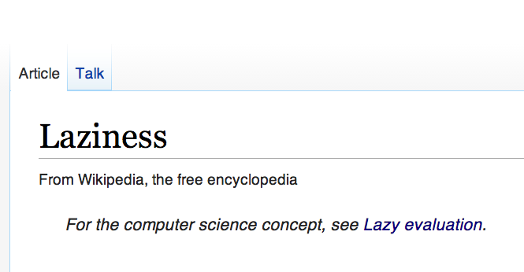

# <br>
# <br>
# [fit] Laziness in Swift
# <br>

### [Maciej Konieczny](http://narf.pl/)<br>[narf.pl](http://narf.pl/) · [macoscope.com](http://macoscope.com)


---
# [fit] narf.pl

---


---
# [fit] SwiftWarsaw.com

---
# [fit] Python :heart_eyes:

---
# [fit] Django :yum:

---
# [fit] JavaScript :weary:

---
# [fit] CoffeeScript :wink:

---
# [fit] Objective-C :confused:

---
# [fit] Swift :open_mouth:

---


---
# [fit] Python :heart_eyes:

---
# [fit] Laziness in Swift

---


---


---
# [fit] delaying computation<br>until necessary

---
# [fit] never necessary<br>never computed

^ avoiding needless calculations

---
# [fit] potential for<br>removing<br>needless computation

---
# [fit] potential for<br>reducing<br>memory footprint

^ e.g. iterating over content of files

---
# [fit] potential for<br>infinite<br>data structures

^ e.g. primes, randomized things

---
# *Laziness allows the expression of programs that would otherwise not terminate*

---
# [fit] not one pattern

---
# [fit] Swift

---
# [fit] `lazy var`

---
# [fit] `SequenceType`

---
# [fit] `@autoclosure`

---
# [fit] `lazy var`

---
    class BlogPost {
        var filename: String

        init(filename: String) {
            self.filename = filename
        }
    }

---
    class BlogPost {
        var filename: String
        var foo = Foo()

        init(filename: String) {
            self.filename = filename
        }
    }

---
    class BlogPost {
        var filename: String
        lazy var foo = Foo()

        init(filename: String) {
            self.filename = filename
        }
    }

---
    class BlogPost {
        var filename: String

        init(filename: String) {
            self.filename = filename
        }
    }

---
    class BlogPost {
        var filename: String
        lazy var markdown: String = {
            markdownForFile(self.filename)
        }()

        init(filename: String) {
            self.filename = filename
        }
    }

---
# [fit] `Swift.nil != ObjC.nil`

---
```
- (NSString *)markdown {
    if (!_markdown) {
        _markdown = markdownForFile(self.filename);
    }

    return _markdown;
}
```

---
# [fit] `SequenceType`

---
    for x in xs {
        // ...
    }

---
    for x in xs {
        // ...
    }

    var _g = xs.generate()
    while let x = _g.next() {
        // ...
    }

---
    class Integers: SequenceType {
        func generate() -> GeneratorOf<Int> {
            var n = -1
            return GeneratorOf { ++n }
        }
    }

---
    class Integers: SequenceType {
        func generate() -> GeneratorOf<Int> {
            var n = -1
            return GeneratorOf { ++n }
        }
    }

    for i in Integers() {
        println(i)  // 0, 1, 2, 3, ...
    }

---
    var integers = lazy(Integers())

---
    var integers = lazy(Integers())

    integers.filter
    integers.map

---
    extension LazySequence {
        var first: LazySequence.Generator.Element? {
            for x in self {
                return x
            }

            return nil
        }
    }

    integers.first!  // 0

---
    var x = integers

---
    var x = integers \
        .filter { $0 % 2 == 1 } \

---
    var x = integers \
        .filter { $0 % 2 == 1 } \
        .map { $0 * $0 }

---
    var x = integers \
        .filter { $0 % 2 == 1 } \
        .map { $0 * $0 } \
        .filter { $0 > 100 } \

---
    var x = integers \
        .filter { $0 % 2 == 1 } \
        .map { $0 * $0 } \
        .filter { $0 > 100 } \
        .first!

---
    var x = integers \
        .filter { $0 % 2 == 1 } \
        .map { $0 * $0 } \
        .filter { $0 > 100 } \
        .first!

    println(x)  // 121

---
    var x = integers.filter {
        return $0 % 2 == 1
    }.map {
        return $0 * $0
    }.filter {
        return $0 > 10
    }.first!

    println(x)  // 25

---
    var x = integers.filter {
        println("\n\($0)")
        println("even?")
        return $0 % 2 == 1
    }.map {
        println("square")
        return $0 * $0
    }.filter {
        println("threshold")
        return $0 > 10
    }.first!

    println(x)  // 25

---
    integers.filter { $0 % 2 == 1 } \
           .map { $0 * $0 }
           .filter { $0 > 10 } \
           .first!

    0 even?
    1 even? square threshold
    2 even?
    3 even? square threshold
    4 even?
    5 even? square threshold

---
# [fit] `@autoclosure`

---
    // without @autoclosure:
    f({ x })

    // with @autoclosure:
    f(x)

---
    func foo(bar: () -> ()) {
        bar()
    }

    foo({ println("baz") })

---
    func foo(bar: @autoclosure () -> ()) {
        bar()
    }

    foo(println("baz"))

---
# [fit] while not x / until x / dopóki x

---
    func dopóki(condition: @autoclosure () -> Bool,
                body: () -> ()) {
        if !condition() {
            body()
            dopóki(condition(), body)
        }
    }


    var i = 3

    dopóki (i == 0) {
        println(i)
        i -= 1
    }

---
# [fit] BTW: compiler performs<br>tail call optimisation

---
# :recycle:

---
# [fit] not one pattern

---
# [fit] removing<br>needless computation

---
# [fit] reducing<br>memory footprint

---
# [fit] expressiveness

---
    lazy var foo = Foo()

---
    lazy var markdown: String = {
        markdownForFile(self.filename)
    }()

---
    for x in xs {
        // ...
    }

    var _g = xs.generate()
    while let x = _g.next() {
        // ...
    }

---
    // without @autoclosure:
    f({ x })

    // with @autoclosure:
    f(x)

---
# [fit] *That's all folks!*

---
# [fit] narf.pl

---


---
# References (1 of 2)

- *Understand and implement laziness*, Matt Might
  <http://matt.might.net/articles/implementing-laziness/>

- *WWDC 2014, Session 404: Advanced Swift*
  <https://developer.apple.com/videos/wwdc/2014/>

---
# References (2 of 2)

- *Lazy by name, lazy by nature*, airspeedvelocity
  <http://airspeedvelocity.net/2014/07/26/lazy-by-name-lazy-by-nature/>

- */r/aww*
  <http://www.panoptikos.com/r/aww/top>

---
# [fit] Questions?
